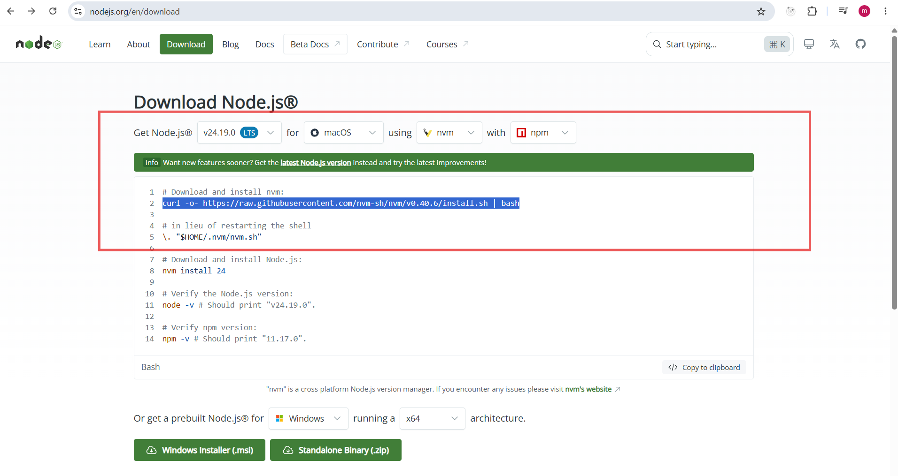
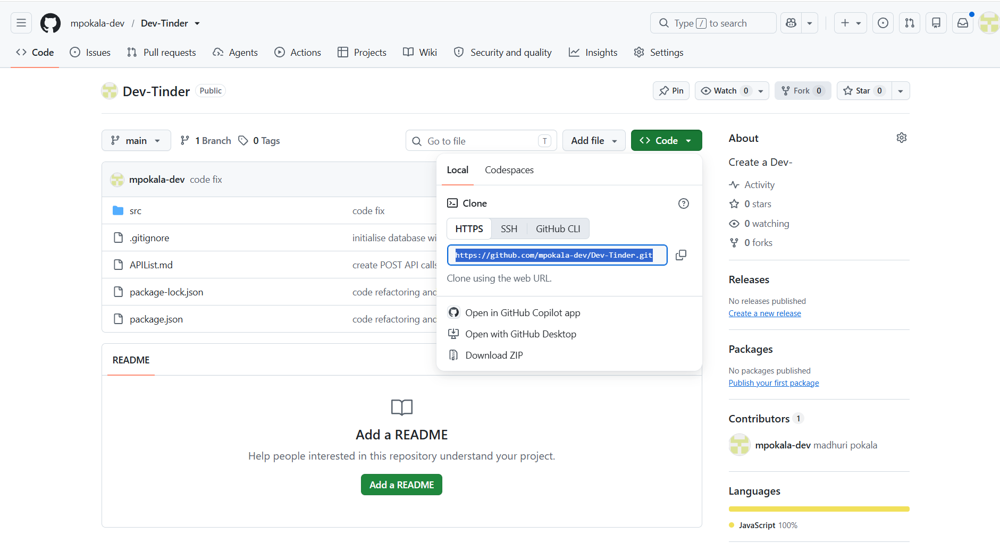
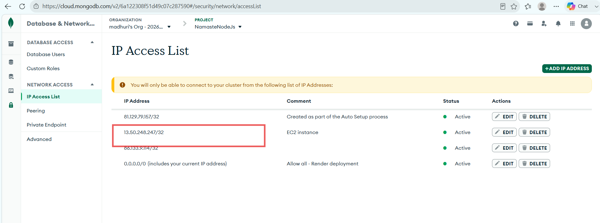

# DevTinder

- Create Vite + React project with the name DevTinder-UI
  <code> npm create vite@latest DevTinder-UI -- --template react </code>
- Remove redundant code and commit the basic scaffold of the DevTinder UI project
- Initialise git repo
  <code> git init </code>
- Create a git repo with the name Dev-Tinder-UI
- Commit the file changes as an initial commit.
  <pre><code>
    git add .
    git commit -m "initial commit | remove redundant code and files"
    git branch -M main
    git remote add origin https://github.com/mpokala-dev/Dev-Tinder-UI.git  
    git push -u origin main
  </code></pre>
- install Tailwind CSS
    <pre><code>
        npm install tailwindcss @tailwindcss/vite <!-- follow the steps from tailwindcss.com docs -->
    </code></pre>
- Install daisyUI - component library
    <pre><code>
        npm i -D daisyui@latest <!-- follow the steps from daisyui.com docs -->
    </code></pre>
- In VS Code install:

Tailwind CSS IntelliSense by Tailwind Labs

This removes many false warnings and gives autocomplete for DaisyUI classes.

- Add Navbar to App.jsx

---

- Seperate Navbar as a component and import Navbar to App.jsx
- Install react router dom
- create BrowserRouter > Routes > Route=/ Body {<Outlet/>}> children Route
- Add Navbar into Body Component to give a fixed Navbar on any path
- Add Outlet to Body Component for children
- Create Footer component

---

- Create Login Page
- Install axios for making API calls
    <pre><code>npm i axios</code></pre>
- CORS - install cors in backend ==> add middleware to App.js with configurations: origin, credentials: true
- Whenever making API call to pass cookies with axios => {withCredentials: true}
- Install Redux Tollkit + react-redux <!-- go though the documentation https://redux-toolkit.js.org/tutorials/quick-start>
    <pre><code>npm install @reduxjs/toolkit react-redux</code></pre>
- Create store
    <pre> => configureStore({
                reducer: {
                    <i>user</i>: <b>userReducer</b> <!-- import userReducer from ".path/<b>userSlice</b>" <i>user</i> is the state slice which is used in useSelector ==> useSelector((state) => state.user) -->
                }
    })
            Provider
            const <b>userSlice</b> = createSlice({
                name:"userstore",<!-- userstore is the name that will be used to extract or subscribe to this particular slice in the store >
                initialState: null,
                reducers: {
                    action1: (state, action)=> {
                        return action.payload;
                    };
                    action2: ...;
                    .
                    .
                    .
                }
            })
            export const {action1, action2, . . . } = <b>userSlice</b>.actions
            export default <b>userSlice</b>.reducer
     </pre>

- Add redux devtools
- Login and see if the logged in data is stored to the redux store
- Navbar should dynamically populated the details as soon as user logs in
- Refactor the folders structure
- use contants.js for URL in APIs
- Use useNavigate() to navigate to feed page once user logs in successfully

---

- If the token is not present redirect the user to /login page
    <pre>Unless the user is logged in do not allow redirect to any page(if not authenticated redirect to login page only)</pre>
- On page refresh or on reload of the application, if the user is logged in once restore the user data in redux store so that user need not login again and again unless the token is expired or user logs out
- <Link to="/profile"/> for profile
- <Link to="/" /> on click of DevTinder
- Logout functionality on Navbar Profile option

---

- build user card on feed page
- clear the feed slice on logout and login
- add { replace: true } option to navigate to replace the current entry in the history stack of navigation instead of adding a new one
<!-- need to handle corner case - if user A logs in and hits /login in the url, and logs in user B => User B feed is shown but on click of navigation arrows of the browser, user A feed is displayed and Navbar profile is also pulling the data of user A -->
- Handled the corner case - root cause if user is already logged in do not allow the user to login page -> redirect to Feed page
- Corrected user data fetching from useSelector for user - updated from useSelector((state)=> {state.user}) to useSelector((state)=> state.user)

---

- Create Profile page where user can update and view his card details.
- Intigrate Toaster to populate success or failure message

---

- Create Connections Page <!-- list out all friends -->
- Create Connection Requests Page <!-- view all friend requests received -->
- Implement request review API calls on Accept and Reject

---

- Ignore and interested API calls on connections page
- Signup page

<!-- Pending -- how do I show the user more than default limit cards when user came across first set of limit of user cards -->
<!-- above issue is fixed with inifinite scrolling | can also be addressed with Lomre option -->
<code>
<!-- TODO if I do not use scroll but straight away ignore or reject the first card that shows up - infinite scroll concept is not working-->

    <pre>
        const feedRef = useRef(feed);
        useEffect(() => { feedRef.current = feed; }, [feed]);
    </pre>
    <pre>
        const getFeedAPI = async (pageParam = 1) => {
            if (loading) return;
            setLoading(true);
            try {
                const res = await axios.get(`${BASE_URL}/user/feed?page=${pageParam}&limit=${limit}`, { withCredentials: true });
                const newData = res?.data?.data || [];
                const merged = pageParam === 1 ? newData : [...(feedRef.current || []), ...newData];
                dispatch(addFeed(merged));
                if (newData.length < limit) setHasMore(false);
            } catch (err) {
                setError(err?.response?.data?.message || "Something is wrong.");
            } finally {
                setLoading(false);
            }
        };
    </pre>

<!-- the above work around is not working. it is triggering infinite API calls with continuous page increment -->
</code>

# dotenv - backend

- npm i dotenv --save
- create a .env file at the root and save all secert keys like DB URL, port number, or JWT secret key etc.
- require("dotenv").config() --> in App.js and add process.env.<VARIABLE_NAME>
- donot forget to add .env to .gitignore

# Deployment

- Sign up on AWS
- generate key-pair login key
- Launch instance
- Open GITBash > cd to where the secret_key.pem file is downloaded > chmod 400 "<secret_key>.pem"
- > ssh -i "<secret_key>.pem" ubuntu@ec2-13-50-248-247.eu-north-1.compute.amazonaws.com
- > install nvm for Nodejs installation (used MacOS nvm cmds cz windows is asking for Docker steps which again requires docker installation)=> 
- nvm install 24.13.0 (// version in which the application is running in our local so that there are no surprise errors on the instance)
- restart by exit
- ssh -i "<secret_key>.pem" ubuntu@ec2-13-50-248-247.eu-north-1.compute.amazonaws.com (reconnect the instance)
- verify node installation by giveing the cmd node -v which should give the version of what we installed
- git clone "git hub HTTP CODE path" (clone DevTinder)
  

- git clone "git hub HTTP CODE path" (clone DevTinder-UI)

- ls (should list you frontend and backend folders)
  DevTinder, DevTinder-UI
- cd DevTinder-UI
  - npm install
  - npm run build (generates .dist folder with all the code changes compiled)
  - > sudo apt update (to install and update the system dependencies of our OS(likely Ubuntu))
  - > sudo apt install nginx
  - > sudo systemctl start nginx
  - > sudo systemctl enable nginx
  - > sudo scp -r dist/\* /var/www/html/
  - Enable port :80 of your instance on AWS > EC2 > instance > Security > Click in Security Groups > Edit inbound rules > and add 80 port for 0.0.0.0/0 and save rules
  - now check the instance public ipv4 address with http(not https), the UI should be UP

- cd DevTinder
  - npm install
  ## .env configuration in ec2 instance
  - > sudo nano .env // to add env variables in production
    <pre>
        DB_URL="mongodb_url+with+password+credentials"
        PORT=port_number
        JWT_SECRET_KEY="JWT_Secret_KEY"
    </pre>
  - save changes
  - allow ec2 public ipv4 address to be access mongodb by whitelisting the public ipv4 address in Data & Network access of MongoDB Atlas
    
  - add port 3000 (or the port_number) that backend runs on to the ec2 security inbound as a Custom TCP
  - npm install pm2 // to keep the backend application onine 24/7
  - pm2 start <b>npm -- start</b> // <b> command for pm2 to start in the background</b>
  - pm2 logs // fetch the logs and errors on backend application
  - pm2 flush npm // npm is the default name taken for the application process to run by the pm2, flush command clears/deletes all the logs so far
  - pm2 list // lists all the processess running along with their application name and status<running|stopped>
  - pm2 stop npm // npm is the application name(which is default taken by pm2), stop cmd stops the process with the name npm
  - pm2 delete npm // deletes the process with name npm
  - pm2 start <b>npm</b> --name "devtinder-backend" <b>-- start</b> // starts the process with name devtinder-backend with the command <b>npm start</b>
  ## Nginx configuration
  - now edit the nginx config to allow or bypass or proxy pass http://localhost:3000 to /api
    - first move to the root, i.e., out of DevTinder // cd
    - > sudo nano /etc/nginx/sites-available/default
    - add below lines to nginx configuration
       <pre><code>
            server_name 13.50.248.247; # Public IPv4 address of EC2 instance
            location /api/ {
                proxy_pass http://localhost:3000/;  # Pass the request to the Node.js app
                proxy_http_version 1.1;
                proxy_set_header Upgrade $http_upgrade;
                proxy_set_header Connection 'upgrade';
                proxy_set_header Host $host;
                proxy_cache_bypass $http_upgrade;
            }
            location / {
                try_files $uri $uri/ /index.html; # helps the route path for nginx to redirect to /index.html if given route not found(refresh scenario)
            }
        </code></pre>
    - restart nginx
      > sudo systemctl restart nginx
